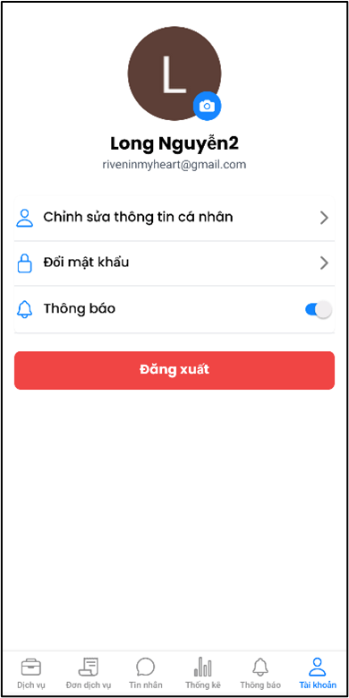

# Rento Mobile App

The Rento Mobile app is built with React Native and Expo, featuring:

- Authentication flows
- Service provider and customer interfaces
- Chatbot functionality
- Service browsing and ordering
- User profiles and reviews

# Images

## Login & Register

    
    
    

## Customer UI

    
    
    

    
    
    

    
    
    

    
    
    

    
    
    

    
    
    

    

## Provider UI

    
    
    

   
    
    

    
    
    

